# Global Logistics Intelligence Hub

[](https://www.python.org/downloads/)
[](https://python.langchain.com/)
[](https://fastapi.tiangolo.com/)
[](https://azure.microsoft.com/en-us/products/ai-services/openai-service)
[](LICENSE)

A **RAG-powered intelligence platform** for global supply chain operations. Ingest logistics documents (PDFs, spreadsheets, API feeds), apply PII masking, and answer complex supply chain questions with full source attribution using hybrid search and LLM generation.

## Architecture

```mermaid
flowchart TB
    subgraph Ingestion["📥 Data Ingestion"]
        PDF[PDF Loader<br/>pdfplumber]
        Excel[Excel Loader<br/>pandas + openpyxl]
        API[API Loader<br/>httpx]
    end

    subgraph Processing["⚙️ Document Processing"]
        PII[PII Masking<br/>Microsoft Presidio]
        Chunk[Semantic Chunker<br/>Parent-Child Indexing]
        Embed[Embedding Service<br/>Azure OpenAI / sentence-transformers]
    end

    subgraph VectorStore["🔍 Hybrid Search"]
        BM25[BM25 Index<br/>rank_bm25]
        FAISS[Dense Vector Index<br/>FAISS]
        RRF[Reciprocal Rank Fusion<br/>30% BM25 / 70% Semantic]
    end

    subgraph RAG["🤖 RAG Pipeline"]
        Retriever[Hybrid Retriever<br/>+ Parent Context Expansion]
        Generator[Response Generator<br/>Azure OpenAI / GPT-4o]
        Chain[LCEL Chain<br/>+ Source Attribution]
    end

    subgraph API_Layer["🌐 API Layer"]
        FastAPI[FastAPI<br/>POST /query · GET /health]
    end

    PDF --> PII
    Excel --> PII
    API --> PII
    PII --> Chunk
    Chunk --> Embed
    Embed --> BM25
    Embed --> FAISS
    BM25 --> RRF
    FAISS --> RRF
    RRF --> Retriever
    Retriever --> Generator
    Generator --> Chain
    Chain --> FastAPI
```



## Features

- **Multi-format ingestion** — PDF (with table extraction), Excel/CSV, REST APIs
- **PII masking** — Microsoft Presidio + custom recognizers for container IDs, customs references, HS codes, and bills of lading
- **Semantic chunking** — Two-tier parent-child indexing preserves context while optimizing retrieval granularity
- **Hybrid search** — Reciprocal Rank Fusion merging BM25 keyword matching (30%) with dense vector similarity (70%)
- **RAG with attribution** — Every answer cites specific source documents and pages
- **Flexible backends** — Azure OpenAI for production, OpenAI or local sentence-transformers for development
- **REST API** — FastAPI endpoints for querying, health checks, and document ingestion

## Quick Start

### Prerequisites

- Python 3.11+
- (Optional) Azure OpenAI or OpenAI API key

### Installation

```bash
# Clone the repository
git clone https://github.com/ahsanrazakhan/global-logistics-intelligence-hub.git
cd global-logistics-intelligence-hub

# Create virtual environment
python -m venv .venv
source .venv/bin/activate  # Linux/Mac
# .venv\Scripts\activate   # Windows

# Install dependencies
pip install -r requirements.txt

# Download spaCy model (required for PII detection)
python -m spacy download en_core_web_lg

# Configure environment
cp .env.example .env
# Edit .env with your API keys
```

### Run the API

```bash
uvicorn src.api.app:app --reload --host 0.0.0.0 --port 8000
```

### Run Tests

```bash
pytest tests/ -v
```

### Try the Demo Notebook

```bash
jupyter notebook notebooks/demo.ipynb
```

## Example Queries

```bash
# Query the API
curl -X POST http://localhost:8000/query \
  -H "Content-Type: application/json" \
  -d '{"question": "What are the current ocean freight rates from Shanghai to Rotterdam?"}'

# Health check
curl http://localhost:8000/health

# Upload a document
curl -X POST http://localhost:8000/ingest \
  -F "file=@docs/sample_report.pdf"
```

### Sample Response

```json
{
  "answer": "Based on the Q3 2024 logistics report, ocean freight rates from Shanghai to Rotterdam have increased by 15% compared to Q2. Spot rates for 40ft containers averaged $4,200 per TEU. The increase is driven by Red Sea diversions forcing vessels through the Cape of Good Hope, extending transit time to 35 days.\n\nSources:\n- logistics_report_q3_2024.pdf, Page 1",
  "sources": [
    {
      "source": "logistics_report_q3_2024.pdf",
      "page": 1,
      "chunk_type": "parent",
      "relevance_score": 0.847
    }
  ],
  "query": "What are the current ocean freight rates from Shanghai to Rotterdam?",
  "processing_time_ms": 1823.45
}
```

## Project Structure

```
global-logistics-intelligence-hub/
├── config/
│   └── settings.py              # Centralized Pydantic settings
├── src/
│   ├── ingestion/               # Document loaders
│   │   ├── pdf_loader.py        # PDF parsing with table extraction
│   │   ├── excel_loader.py      # Excel/CSV to Markdown conversion
│   │   └── api_loader.py        # REST API data fetching
│   ├── processing/              # Document processing pipeline
│   │   ├── chunking.py          # Semantic chunker with parent-child indexing
│   │   ├── pii_masking.py       # Presidio-based PII masking
│   │   └── embeddings.py        # Multi-backend embedding service
│   ├── vectorstore/             # Search infrastructure
│   │   ├── azure_search.py      # Azure AI Search integration
│   │   └── hybrid_search.py     # BM25 + FAISS hybrid with RRF
│   ├── rag/                     # RAG pipeline
│   │   ├── retriever.py         # Hybrid retriever with context expansion
│   │   ├── generator.py         # LLM response generation
│   │   └── chain.py             # LCEL chain with source attribution
│   └── api/
│       └── app.py               # FastAPI application
├── tests/                       # Test suite
├── notebooks/
│   └── demo.ipynb               # Interactive demo
├── docs/                        # Documentation
│   ├── architecture.md          # System design details
│   └── setup.md                 # Deployment guide
└── data/sample/                 # Sample data directory
```

## Tech Stack

| Component | Technology |
|-----------|-----------|
| LLM Orchestration | LangChain 0.3 + LCEL |
| LLM Provider | Azure OpenAI / OpenAI (GPT-4o) |
| Embeddings | Azure OpenAI / sentence-transformers |
| Vector Store | FAISS (local) / Azure AI Search (production) |
| Keyword Search | BM25 via rank_bm25 |
| PII Detection | Microsoft Presidio |
| PDF Parsing | pdfplumber |
| API Framework | FastAPI |
| Configuration | Pydantic Settings |

## Author

**Ahsan Raza Khan**

## License

This project is licensed under the MIT License.
